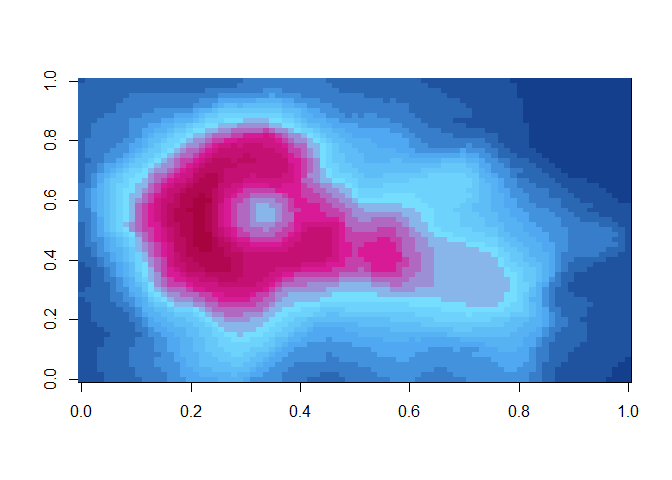
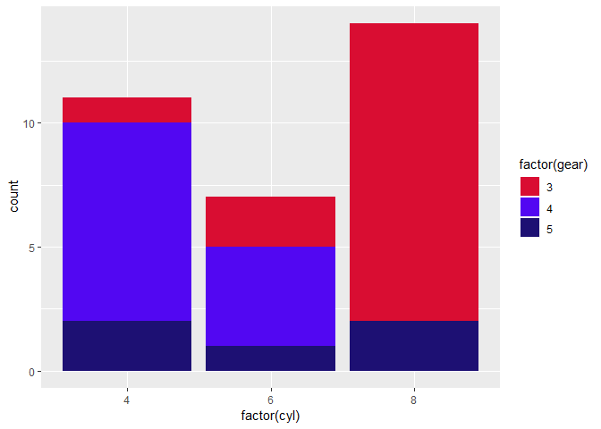

Holiday snap palettes
=====================

Here are some pallettes I have made from my own holiday snaps. This is based on the excellent wespalette package and is for personal use only.

Installation
------------

``` r
remotes::install_github("mrc-ide/snapalette")
```

Usage
-----

``` r
library("snapalette")
# See all palettes
names(snapalettes)
#>  [1] "Mosaic"          "EspiritoSanta"   "ST_art"         
#>  [4] "DiscoverySuites" "IpanemaSunset"   "Orchid"         
#>  [7] "CaveHouse"       "Kalypso"         "ThiraJazz"      
#> [10] "Camden"          "Venice"          "Barcelona"      
#> [13] "Fjord"           "Stavanger"       "SweetShop"      
#> [16] "Wales"           "SzimplaKert"     "BudapestCitadel"
#> [19] "Ipanema"
```

Palettes
--------

### Mosaic from Fiocruz

``` r
snapalette("Mosaic")
```


### EspiritoSanta

``` r
snapalette("EspiritoSanta")
```


### Street art

``` r
snapalette("ST_art")
```


### Discovery Suites

``` r
snapalette("DiscoverySuites")
```


### Ipanama sunset

``` r
snapalette("IpanemaSunset")
```


### Orchid

``` r
snapalette("Orchid")
```


### Greek cave house

``` r
snapalette("CaveHouse")
```


### Kalypso

``` r
snapalette("Kalypso")
```


``` r
pal <- snapalette("Kalypso", 21, type = "continuous")
image(volcano, col = rev(pal))
```



### ThiraJazz

``` r
snapalette("ThiraJazz")
```


### Camden

``` r
snapalette("Camden")
```


### Venice

``` r
snapalette("Venice")
```


### Barcelona

``` r
snapalette("Barcelona")
```


``` r
library("ggplot2")
ggplot(mtcars, aes(factor(cyl), fill=factor(gear))) +  geom_bar() +
scale_fill_manual(values =snapalette("Barcelona"))
```



### Fjord

``` r
snapalette("Fjord")
```


### Stavanger

``` r
snapalette("Stavanger")
```


### Sweet Shop

``` r
snapalette("SweetShop")
```


### Wales

``` r
snapalette("Wales")
```


### Szimpla Kert

``` r
snapalette("SzimplaKert")
```


### Budapest Citadel

``` r
snapalette("BudapestCitadel")
```


### Ipanama

``` r
snapalette("Ipanema")
```


